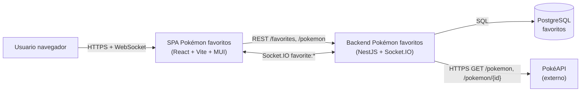
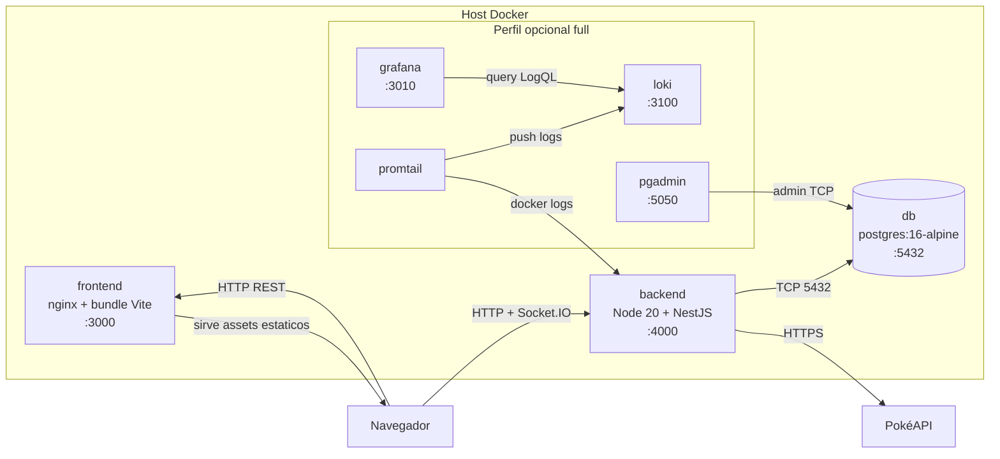

# Pokémon favoritos — prueba técnica full stack

SPA **React** + API **NestJS** que consume **PokéAPI**, persiste **favoritos** en **PostgreSQL** y sincroniza cambios en tiempo real con **Socket.IO** (`favorite:added`, `favorite:removed`, `favorite:updated`). Stack dockerizado en un único [`docker-compose.yml`](docker-compose.yml).

---

## Guía de revisión (evaluador)

Orden sugerido para validar el entregable:

1. **Guía y checklist:** criterios típicos de una prueba full stack (PokéAPI, favoritos, tiempo real, Docker) en [docs/GUIA_ENTREGA.md](docs/GUIA_ENTREGA.md#11-checklist-de-entrega-vs-enunciado); decisiones técnicas y alcance en este README.
2. **Arranque:** desde la raíz del repo, **`docker compose up`** (defaults listos para localhost; `cp .env.example .env` y `--build` solo si quieres personalizar variables o reconstruir, detalle en [Instalación y ejecución con Docker](#instalación-y-ejecución-con-docker-recomendado)).
3. **URLs:**
   - Aplicación: [http://localhost:3000](http://localhost:3000)
   - API y Swagger: [http://localhost:4000/api-docs](http://localhost:4000/api-docs)
   - YAML: [http://localhost:4000/openapi.yaml](http://localhost:4000/openapi.yaml)
4. **Tiempo real:** procedimiento en [Cómo probar el feature de tiempo real](#cómo-probar-el-feature-de-tiempo-real) (dos pestañas, misma `X-Client-Id`).
5. **Tests (opcional):** [Tests](#tests) en máquina host con Node 20+; la imagen Docker de producción no incluye runners de test.

Recorrido ampliado (Docker, Grafana/Loki, `curl`, diagramas): [docs/GUIA_ENTREGA.md](docs/GUIA_ENTREGA.md). Contrato HTTP de referencia: [docs/openapi.yaml](docs/openapi.yaml).

---

## Decisiones técnicas

- **Backend:** NestJS + TypeScript, arquitectura **hexagonal** (dominio y casos de uso sin acoplarse a HTTP, ORM ni sockets; puertos en `application/ports`, adaptadores en `infrastructure`).
- **Logs:** acceso HTTP (`context: Http`, método, ruta, `statusCode`, duración) y eventos socket (`context: Socket`) en **JSON por línea** cuando `STRUCTURED_LOGS=true` (activado en `docker-compose.yml` para el servicio `backend`). Errores de dominio mapeados a HTTP se registran en el filtro con el mismo formato.
- **Persistencia:** TypeORM + PostgreSQL. El [`backend/Dockerfile`](backend/Dockerfile) usa un **CMD condicional:** si `TYPEORM_SYNC=true` (como en [`docker-compose.yml`](docker-compose.yml)), solo arranca `node dist/main.js` y Nest sincroniza el esquema; si no, ejecuta antes `migration:run` contra [`data-source.ts`](backend/src/infrastructure/persistence/data-source.ts) compilado en `dist/` y después levanta la API.
- **Usuario / cliente:** sin autenticación real. Cada navegador envía **`X-Client-Id`** (UUID en `localStorage`, ver `frontend/src/utils/clientId.ts`) en REST y en **`auth.clientId`** al conectar Socket.IO. Sin cabecera, el backend usa el id **`default`**. Los favoritos se guardan en BD con columna `clientId` y unicidad `(clientId, pokemonId)`.
- **Favoritos duplicados:** mismo `pokemonId` dos veces → respuesta **409 Conflict**.
- **Frontend:** React + Vite; llamadas al backend propio; cliente Socket.IO con URL base `VITE_API_URL`.
- **Tiempo real:** el backend emite `favorite:added`, `favorite:removed` y `favorite:updated` (esta última al editar nota). Los payloads incluyen `favoriteId`, `pokemonId`, `note`, `createdAt` cuando aplica.

### Seguridad y límites (demo)

- **CORS:** orígenes permitidos vienen de la variable **`CORS_ORIGINS`** (coma-separada). En Docker hay valores por defecto en [`docker-compose.yml`](docker-compose.yml), sobrescribibles con un `.env` en la raíz del repo (véase [.env.example](.env.example)); vacío en desarrollo puede ser permisivo según [`config/cors-config.ts`](backend/src/config/cors-config.ts). Se permiten cabeceras **`X-Client-Id`** y **`Content-Type`** en preflight.
- **Listado Pokémon:** query `limit` está acotada entre **1 y 100** en [`pokemon.controller.ts`](backend/src/presentation/pokemon.controller.ts).
- **Rate limiting:** [`@nestjs/throttler`](https://docs.nestjs.com/security/rate-limiting) global con `THROTTLE_TTL`/`THROTTLE_LIMIT` (defaults `60000` ms / `60` requests). Mutaciones `POST/DELETE/PATCH /favorites` con límite más estricto (`20/60s`). `/health` y `/metrics` excluidos con `@SkipThrottle()` para no bloquear scrapers ni probes.
- **Dos pestañas en el mismo navegador** comparten el mismo `X-Client-Id` (misma lista). **Dos perfiles o dispositivos** con ids distintos tienen listas independientes.

Detalle ampliado de decisiones y alternativas evaluadas: [docs/adr/](docs/adr/).

---

## Arquitectura (vista C4 simplificada)

Dos vistas inspiradas en el modelo C4 de Simon Brown: contexto (qué actores y sistemas externos toca la aplicación) y contenedores (qué procesos corren y cómo se comunican). Renderizan en GitHub y en Cursor sin estilos custom.

### Nivel 1 — Contexto



### Nivel 2 — Contenedores



Hexagonal interno del backend: `domain/` (entidades puras), `application/` (casos de uso + puertos), `infrastructure/` (TypeORM, cliente PokéAPI, observabilidad), `presentation/` (HTTP controllers + Socket.IO gateway + middlewares).

---

## Requisitos previos

- **Docker** 24+ y Docker Compose v2 (`docker compose`).

---

## Instalación y ejecución con Docker (recomendado)

### Arranque mínimo (solo levantar el proyecto)

Desde la raíz del repositorio, sin tocar nada más:

```bash
docker compose up
```

El [`docker-compose.yml`](docker-compose.yml) trae **defaults listos para localhost** (puertos, credenciales de Postgres, `CORS_ORIGINS`, `VITE_API_URL`, etc.), por lo que **no hace falta crear `.env`**. El primer arranque construye las imágenes y levanta por defecto **`db`**, **`backend`** y **`frontend`**.

### Opcional — personalizar variables o forzar rebuild

Solo si quieres sobrescribir algún default (puertos, credenciales, orígenes CORS) o reconstruir las imágenes tras cambios en el código:

```bash
cp .env.example .env   # ajustar variables si quieres sobrescribir defaults
docker compose up --build
```

**pgAdmin**, **Loki**, **Promtail** y **Grafana** son opcionales, perfil **`full`**: `docker compose --profile full up` (añade `--build` si lo necesitas).

Cuando los servicios estén listos:

- Frontend: [http://localhost:3000](http://localhost:3000)
- Backend HTTP/Socket.IO: [http://localhost:4000](http://localhost:4000)
- PostgreSQL: puerto **5432** en el host (credenciales según `docker-compose.yml` / [.env.example](.env.example)).
- pgAdmin (solo perfil `full`): [http://localhost:5050](http://localhost:5050); al registrar el servidor PostgreSQL, **Host** = nombre del servicio **`db`**, no `localhost`.

Variables: [.env.example](.env.example) (bloque **Docker Compose** lista las claves interpolables).

### Desarrollo local (sin Docker)

Opcional frente al stack con contenedores: PostgreSQL en el host (base `pokemon`), variables según [.env.example](.env.example); `npm install` y `npm run start:dev` en `backend/`; en `frontend/` `npm install`, `frontend/.env.local` con `VITE_API_URL=http://localhost:4000` y `npm run dev`.

---

## Puertos

| Servicio | Puerto (host) | Notas |
|----------|----------------|--------|
| Frontend | 3000 | |
| Backend API + WebSocket | 4000 | |
| PostgreSQL | 5432 | |
| pgAdmin | 5050 | solo con `--profile full` |
| Grafana | 3010 | solo con `--profile full` |
| Loki | 3100 | solo con `--profile full` |
| Prometheus | 9090 | solo con `--profile full` |
| Tempo (query/UI) | 3200 | solo con `--profile full` |

Perfil opcional, variables y pgAdmin paso a paso: [docs/HERRAMIENTAS.md](docs/HERRAMIENTAS.md).

---

## Cómo probar el feature de tiempo real

1. Con el stack en marcha (`docker compose up`), abre **dos pestañas** en `http://localhost:3000`.
2. En la pestaña A, **Pokémon** → detalle → **Añadir a favoritos** (o opera desde **Favoritos**).
3. En la pestaña B, abre **Favoritos**: la lista debe **actualizarse sola** sin recargar si A crea, elimina o cambia una nota.
4. Opcional: **toast** abajo a la derecha cuando el cambio viene de la otra pestaña (no suele duplicarse para la propia acción reciente en la misma pestaña).
5. En los **logs del backend** deben verse conexión/desconexión de sockets y emisión de eventos (requisito del enunciado).

---

## Endpoints del backend

Prefijo: ninguno (raíz).

| Método | Ruta | Descripción |
|--------|------|-------------|
| GET | `/health` | Probe de proceso + conexión a BD (usado por healthcheck Docker) |
| GET | `/metrics` | Métricas Prometheus en texto plano |
| GET | `/pokemon` | Lista paginada (`offset`, `limit`; default limit 20, máx. 100) |
| GET | `/pokemon/:id` | Detalle normalizado (id numérico o nombre) |
| GET | `/favorites` | Lista de favoritos |
| POST | `/favorites` | Crea favorito (`pokemonId`, `pokemonName`, `imageUrl`, `note` opcional; ver OpenAPI) |
| DELETE | `/favorites/:id` | Elimina por UUID del favorito |
| PATCH | `/favorites/:id` | Actualiza nota (`note`: string o null) |

### Eventos Socket.IO

| Evento | Payload (resumen) |
|--------|-------------------|
| `favorite:added` | `clientId`, `favoriteId`, `pokemonId`, `note`, `createdAt`, … |
| `favorite:removed` | `clientId`, `favoriteId`, `pokemonId` |
| `favorite:updated` | `clientId`, `favoriteId`, `pokemonId`, `note`, `createdAt`, … |

Emisión acotada a la sala del mismo `clientId` que en `auth` al conectar.

**Contrato HTTP (OpenAPI 3):** referencia en [docs/openapi.yaml](docs/openapi.yaml); en runtime la copia desplegada es [`backend/openapi.yaml`](backend/openapi.yaml) (`GET /openapi.yaml`). **Swagger UI:** [http://localhost:4000/api-docs](http://localhost:4000/api-docs) con el backend en marcha.

---

## Tests

Los tests **no son obligatorios** en el enunciado, pero demuestran regresión rápida sobre casos de uso (backend), utilidades compartidas, un camino HTTP real (e2e) y comportamiento de hooks/UI (frontend).

**Dónde ejecutarlos:** las imágenes Docker usan `npm ci --omit=dev`: **no** incluyen Jest ni Vitest. Corre todo en el **host** con **Node.js 20+** y `npm install` en cada carpeta (`backend/`, `frontend/`) la primera vez.

### Backend — unitarios (Jest)

Ejercitan **casos de uso** de favoritos con puertos simulados (`application/use-cases/*.spec.ts`) y la utilidad **`TtlCache`** (`infrastructure/common/ttl-cache.spec.ts`). Variables de entorno típicas: [.env.example](.env.example) en la raíz (según cómo Jest cargue la config del proyecto; si falla por BD, levanta PostgreSQL como para desarrollo).

```bash
cd backend && npm test
```

### Backend — e2e (Jest + Supertest + Testcontainers)

Levantan la aplicación Nest con [`AppModule`](backend/src/app.module.ts) y llaman HTTP reales. El spec actual comprueba que **`GET /favorites`** responde **200** y un **array** ([`test/app.e2e-spec.ts`](backend/test/app.e2e-spec.ts)).

**Postgres efímero con Testcontainers**: el `globalSetup` ([`test/e2e-global-setup.ts`](backend/test/e2e-global-setup.ts)) levanta un contenedor `postgres:16-alpine`, expone `DB_HOST`/`DB_PORT`/etc. al test runner y el `globalTeardown` ([`test/e2e-global-teardown.ts`](backend/test/e2e-global-teardown.ts)) lo detiene y elimina al final. **Sólo requiere Docker daemon** corriendo en el host; **no** necesitas Postgres instalado. Config: [`jest-e2e.config.cjs`](backend/jest-e2e.config.cjs).

```bash
cd backend && npm run test:e2e
```

**Modo legacy** sin contenedor (si Docker no está disponible, p. ej. en una máquina con Postgres local ya configurado): `E2E_USE_TESTCONTAINERS=false npm run test:e2e`.

**Opcional:** `npm run test:all` en `backend/` ejecuta unitarios y e2e seguidos (`npm test && npm run test:e2e`).

### Frontend (Vitest + Testing Library)

Prueban hooks de favoritos, socket simulado, listado/detalle Pokémon y fragmentos de UI (paginación, vista de favoritos). Configuración: [`frontend/vite.config.ts`](frontend/vite.config.ts); matchers DOM: [`frontend/src/test-setup.ts`](frontend/src/test-setup.ts).

```bash
cd frontend && npm test
```

| Área | Ubicación típica |
|------|------------------|
| Hooks favoritos / socket | `frontend/src/features/favorites/*.test.tsx` |
| Lista y detalle Pokémon | `frontend/src/features/pokemon-list/`, `pokemon-detail/` |
| UI favoritos / paginación | `features/favorites/FavoritesView.test.tsx`, `shared/components/ListPaginationFooter.test.tsx` |

---

## Cómo escalaríamos esto a producción

Esta prueba se entregó como monolito modular con arquitectura hexagonal. Sirve para describir cómo evolucionaría hacia un sistema productivo sin reescribirlo. Cada bullet es una decisión que dejaría documentada en un ADR aparte cuando llegue el momento.

### Tráfico y procesos stateless

- Múltiples réplicas del `backend` detrás de un balanceador (Nginx, Traefik o un Ingress de Kubernetes).
- **Adapter Redis para Socket.IO** (`@socket.io/redis-adapter`) para que las salas (`clientRoomName`) funcionen entre instancias. Sin esto, el evento emitido en la réplica A no llega a un cliente conectado a la réplica B.
- Sticky sessions sólo si la negociación inicial de Socket.IO lo requiere; con `transports: ['websocket']` se puede evitar.
- CDN delante del bundle estático (S3 + CloudFront, Cloudflare Pages, Vercel) y compresión Brotli en nginx.
- Healthchecks separados de readiness y liveness en orquestadores (`/health` cubre ambos hoy; en K8s convendría dos probes con diferente tolerancia).

### Persistencia y caché

- **PgBouncer** (transaction pooling) delante de Postgres para evitar agotar conexiones bajo carga.
- Índices revisados explícitamente: además de la unicidad `(clientId, pokemonId)`, índice por `clientId` para `GET /favorites`. Revisar con `EXPLAIN ANALYZE` cuando crezca el volumen.
- **Redis** como caché compartida del proxy a PokéAPI (hoy es `TtlCache` en memoria por instancia; con varias réplicas se duplica el trabajo).
- Paginación cursor-based si el catálogo crece (PokéAPI ya pagina, pero los favoritos también podrían).
- Migraciones forward-only con TypeORM; `synchronize: false` en producción y `migration:run` en el arranque (el [`backend/Dockerfile`](backend/Dockerfile) ya tiene el `CMD` condicional para esto).

### Eventos y desacoplamiento

- **Patrón Outbox** para evitar la inconsistencia BD↔socket: el caso de uso escribe favorito + evento en la misma transacción de Postgres; un publisher asíncrono entrega el evento al gateway o broker y marca la fila como enviada.
- Migración del fan-out a un broker real (**RabbitMQ** o **Kafka**, según retención requerida): el backend publica `favorite.added/removed/updated`, los gateways de WebSocket suscriben y emiten a sus clientes locales.
- Consumers idempotentes con `eventId` único; deduplicación con tabla `processed_events` o cache TTL.
- Dead Letter Queue para errores transitorios + retry con backoff exponencial.
- Si en algún momento aparece "favorito sincronizado entre dispositivos del mismo usuario", el broker absorbe ese cambio sin tocar el dominio.

### Seguridad real

- Autenticación: OAuth2/OIDC (Keycloak, Auth0, Cognito) o JWT propio con refresh tokens. `X-Client-Id` se reemplaza derivando `clientId` del `sub` del token.
- Rate limiting por IP **y** por usuario autenticado (hoy hay `@nestjs/throttler` global como demo); CDN/WAF como primera línea contra abuso.
- Headers de seguridad con `helmet` (CSP, HSTS, X-Frame-Options, Referrer-Policy).
- Secrets fuera del repo: AWS Secrets Manager / GCP Secret Manager / Vault / SOPS. Variables de entorno sólo para configuración no sensible.
- CORS estricto por entorno (hoy ya hay `CORS_ORIGINS` configurable; en prod nunca `*`).
- Validación de entrada con `class-validator` (ya activo) + sanitización de notas para evitar XSS si se renderizan como HTML.
- Auditoría: log estructurado de mutaciones con `userId`, `action`, `entity`, `before/after`.

### Observabilidad completa (los tres pilares)

- **Logs** *(hecho en demo)*: JSON estructurado a stdout, agregados en Loki vía Promtail (perfil `full`). Con OTel activo, cada línea incluye `traceId`/`spanId`.
- **Métricas** *(hecho en demo)*: `/metrics` con `prom-client` scrappeado por Prometheus; dashboard **golden signals** (latency p50/p95/p99 por ruta, traffic RPS, errors 4xx/5xx, saturation RSS + event loop lag) provisionado en Grafana.
- **Tracing distribuido** *(hecho en demo)*: backend auto-instrumentado con `@opentelemetry/sdk-node` (HTTP, Express, axios, pg, Socket.IO); OTLP → OTel Collector → Tempo; correlación bidireccional con Loki.
- **Pendiente para producción**: Alertmanager (alertas sobre 5xx, p95 latencia, lag de event loop), sampling parent-based en lugar de `always_on`, retention y storage S3/GCS para Tempo, propagación `traceparent` desde el frontend (hoy solo backend↔BD↔PokéAPI), integración con APM SaaS si aplica.

### CI/CD y delivery

- Pipeline en [.github/workflows/ci.yml](.github/workflows/ci.yml) con lint + test + build + Docker build (ya implementado).
- Pipeline de despliegue separado: build de imágenes etiquetadas con `git sha`, push a registry (GHCR, ECR, GAR), deploy con Helm o Argo CD a Kubernetes.
- **Blue/green** o **canary** con feature flags (LaunchDarkly, Unleash, Flagsmith) para activar features gradualmente.
- Migraciones forward-only ejecutadas en un init container o job previo al rollout.
- Pruebas de integración con Testcontainers (ya configuradas para e2e local) replicadas en CI con el mismo container daemon.

### Multi-tenant real y aislamiento

- `clientId` opaco actual evoluciona a `userId` (autenticado) + `tenantId` opcional para clientes B2B.
- Si los datos exigen aislamiento fuerte (regulación), **Row Level Security** de Postgres con `tenant_id` en la sesión.
- Si se requiere aislamiento total, esquema o BD por tenant con un router en la capa de persistencia.
- Cuotas y límites por tenant: ya hay throttler general; se extiende con `@Throttle()` sobre el `userId`/`tenantId`.

### Decisiones intencionalmente fuera de alcance

- No hay autenticación real: el enunciado lo permite y el dominio queda preparado para JWT sin reescritura.
- No hay broker de eventos: con un solo proceso, Socket.IO directo basta y deja claro el caso. Migrar a Outbox+broker es cambio de adaptador, no de dominio.
- No hay tracing distribuido: añadir OTel es ~30 líneas adicionales pero se descartó para mantener el setup demo simple.
- No hay despliegue real ni Helm chart: queda fuera del alcance "una semana".

---

## Estructura del monorepo

- `backend/` — NestJS hexagonal (`domain`, `application`, `infrastructure`, `presentation`; módulos `favorites`, `pokemon`, TypeORM).
- `frontend/` — React + Vite.
- `docker-compose.yml` — stack por defecto `db`, `backend`, `frontend`; perfil **`full`** para pgAdmin + observabilidad; healthcheck del backend antes del frontend.
- `observability/` — Loki, Promtail, provisioning Grafana.
- `docs/` — [GUIA_ENTREGA.md](docs/GUIA_ENTREGA.md), [HERRAMIENTAS.md](docs/HERRAMIENTAS.md) y [openapi.yaml](docs/openapi.yaml) (referencia; la API sirve [`backend/openapi.yaml`](backend/openapi.yaml)).

---

## Observabilidad — los tres pilares (perfil full)

No forma parte del requisito mínimo del enunciado. `docker compose --profile full up` levanta un stack autocontenido con **logs**, **métricas** y **trazas** correlacionadas. Decisiones documentadas en [docs/adr/0002-observabilidad-tres-pilares.md](docs/adr/0002-observabilidad-tres-pilares.md).

### Logs — Loki + Promtail

Promtail descubre los contenedores Docker y empuja líneas JSON estructuradas a Loki. Grafana ([http://localhost:3010](http://localhost:3010)) consulta vía LogQL:

```logql
{container=~".*backend.*"} | json | context="Socket"
```

```logql
{container=~".*backend.*"} | json | statusCode >= 400
```

Cuando OTel está activo (perfil `full`), cada línea incluye además `traceId` y `spanId`. El datasource Loki expone un *derived field* que convierte ese `traceId` en un enlace clicable hacia Tempo.

### Métricas — Prometheus + `prom-client`

El backend expone siempre [`GET /metrics`](http://localhost:4000/metrics) en formato `text/plain` (`http_requests_total`, `http_request_duration_seconds`, `socket_events_emitted_total` y métricas por defecto del proceso Node). Prometheus ([http://localhost:9090](http://localhost:9090)) lo scrappea cada 15 segundos.

Consultas PromQL de ejemplo:

```promql
histogram_quantile(0.95, sum by (le, route) (rate(http_request_duration_seconds_bucket[5m])))
```

```promql
sum by (route) (rate(http_requests_total[1m]))
```

```promql
sum by (event) (rate(socket_events_emitted_total[1m]))
```

**Dashboard provisionado**: Grafana → carpeta general → **"Pokemon Favorites - Golden Signals"** ([JSON](observability/grafana/provisioning/dashboards/golden-signals.json)) — latencia (p50/p95/p99 por ruta), tráfico (RPS por ruta), errores 4xx y 5xx (% del tráfico), saturación (RSS + event loop lag) y eventos Socket.IO emitidos.

### Trazas — OpenTelemetry + Tempo

El backend está auto-instrumentado con `@opentelemetry/sdk-node` ([backend/src/infrastructure/observability/tracing.ts](backend/src/infrastructure/observability/tracing.ts)). Las trazas viajan por OTLP/HTTP al **OTel Collector** (`otel-collector:4318`) y de ahí a **Tempo** ([http://localhost:3200](http://localhost:3200)). El Collector es pass-through en demo; en producción aporta batching, sampling centralizado y multi-export.

Auto-instrumentaciones activas: HTTP, Express, axios (cliente PokéAPI), `pg` (TypeORM/Postgres), Socket.IO. La instrumentación de `fs` está deshabilitada por ruido.

**Gating**: el SDK no arranca si `OTEL_ENABLED=false`, falta `OTEL_EXPORTER_OTLP_ENDPOINT` o `NODE_ENV=test`. Por eso los tests Jest/Vitest no intentan conectar al collector.

Consultas TraceQL de ejemplo (Grafana → Explore → Tempo):

```traceql
{ resource.service.name = "pokemon-favorites-backend" && status = error }
```

```traceql
{ name =~ "GET /favorites" && duration > 100ms }
```

### Correlación logs ↔ trazas (los pilares conectados)

El stack queda conectado en ambos sentidos sin tocar código:

1. **Log → Traza**: en Grafana → Explore → Loki, cada línea con `traceId` muestra un botón "Ver traza en Tempo" (derived field configurado en [observability/grafana/provisioning/datasources/loki.yml](observability/grafana/provisioning/datasources/loki.yml)).
2. **Traza → Log**: en Tempo, cada span tiene un botón "Logs for this span" que abre Loki filtrado por `traceId="..."` (`tracesToLogsV2` en [observability/grafana/provisioning/datasources/tempo.yml](observability/grafana/provisioning/datasources/tempo.yml)).

### Smoke test del stack

```bash
docker compose --profile full up --build
# en otra terminal:
curl http://localhost:9090/-/healthy            # Prometheus 200
curl http://localhost:3200/ready                # Tempo 200
curl http://localhost:4000/metrics | head       # exposición Prometheus
for i in {1..10}; do curl -s http://localhost:4000/favorites > /dev/null; done
# Grafana → dashboard "Pokemon Favorites - Golden Signals" debe poblarse en ~30s
```

Con `docker compose up` **sin** `--profile full` no se descargan estos servicios opcionales (menos pulls si Docker Hub va lento). Detalle: [docs/HERRAMIENTAS.md](docs/HERRAMIENTAS.md).

---

## Docker build falla: DNS / `registry-1.docker.io`

Si aparece un error de resolución tipo:

`lookup registry-1.docker.io on [fe80::1%...]:53: ... connection refused`

suele ser el **resolvedor DNS del sistema** (p. ej. `nameserver fe80::1` en `/etc/resolv.conf`).

**Opciones:**

1. **Docker:** en `/etc/docker/daemon.json`, añadir `"dns": ["8.8.8.8", "8.8.4.4"]` (o la IP del router), `sudo systemctl restart docker`, volver a construir.
2. **Sistema:** DNS públicos fiables o corregir IPv6 roto en la configuración de red.

El fallo ocurre al resolver Docker Hub, **antes** de ejecutar el código del proyecto. El stack mínimo solo requiere PostgreSQL externo y builds locales de backend/frontend.
