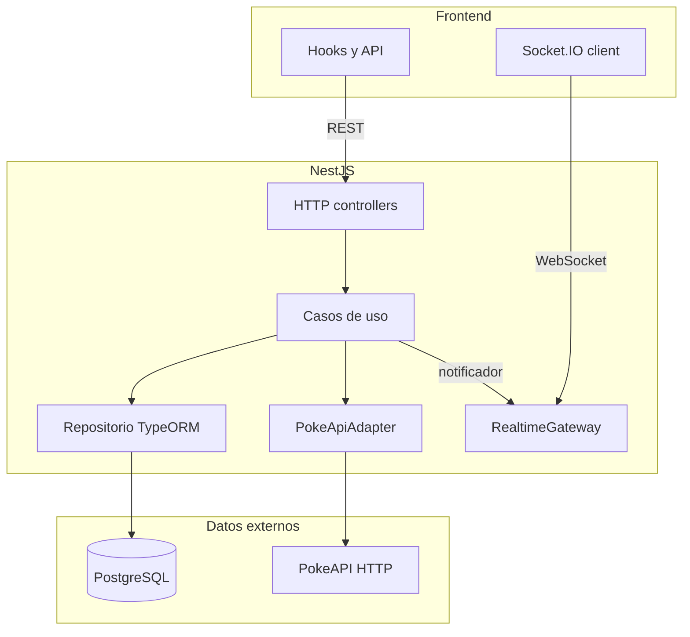
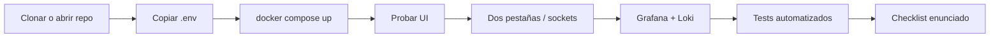

# Guía de entrega — Pokémon favoritos (full stack)

Documento didáctico para **instalar, verificar, probar y entregar** el proyecto sin depender solo de fragmentos dispersos. La referencia técnica completa sigue en el [**README**](../README.md) raíz; aquí el foco es un **recorrido lineal** con resultados esperados y evidencias para evaluadores.

**Documentación relacionada**

| Recurso | Uso |
|---------|-----|
| [README.md](../README.md) | Decisiones técnicas, troubleshooting DNS Docker, tablas de puertos y endpoints |
| [docs/openapi.yaml](openapi.yaml) | Contrato HTTP OpenAPI 3 (referencia; la API sirve la copia `backend/openapi.yaml`) |
| [observability/](../observability/) | Loki, Promtail, Prometheus, Tempo, OTel Collector y *provisioning* de Grafana (datasources + dashboards) |
| [docs/HERRAMIENTAS.md](HERRAMIENTAS.md) | pgAdmin, Grafana, Loki, Prometheus y Tempo: paso a paso con Docker |
| [docker-compose.yml](../docker-compose.yml) | Stack único: por defecto `db`, `backend`, `frontend`; pgAdmin, Loki, Promtail, Grafana, Prometheus, Tempo y OTel Collector (perfil `full`) |

---

## 1. Propósito del proyecto

**Objetivo de negocio:** listar y ver detalle de Pokémon (datos desde **PokéAPI**), persistir **favoritos** en **PostgreSQL** y sincronizar cambios en **tiempo real** con **Socket.IO** entre pestañas o clientes.

**Stack:** NestJS (hexagonal) + React (Vite) + Postgres + Socket.IO; opcionalmente **Grafana + Loki + Prometheus + Tempo** (los tres pilares de observabilidad) para logs estructurados, métricas y trazas correlacionadas.

---

## 2. Requisitos del entorno

| Herramienta | Versión recomendada |
|-------------|---------------------|
| Docker | 24+ |
| Docker Compose | v2 (`docker compose`) |
| Node.js | 20+ (solo si ejecutas **sin** Docker: backend y frontend en máquina host) |

Copia de variables de ejemplo: [.env.example](../.env.example). El frontend en Docker recibe `VITE_API_URL` en tiempo de *build* según el [`docker-compose.yml`](../docker-compose.yml).

---

## 3. Puesta en marcha con Docker (recomendado)

**Por qué `--build` la primera vez:** construye las imágenes del backend y frontend; arranques posteriores pueden usar solo `docker compose up` si las imágenes ya existen.

**Nota (backend en Docker):** con `TYPEORM_SYNC=true` (definido en Compose para el servicio `backend`) el contenedor **no** ejecuta migraciones al arrancar: Nest sincroniza el esquema. Si el backend reinicia en bucle o hay errores de esquema, revisa `docker compose logs backend` y el bullet de persistencia en el [README](../README.md#decisiones-técnicas).

### Paso 1 — Obtener el código

Sitúate en la raíz del repositorio (donde está `docker-compose.yml`).

**Comprueba:** existe la carpeta `backend/`, `frontend/` y el archivo `docker-compose.yml`.

### Paso 2 — Variables de entorno

```bash
cp .env.example .env
```

**Esperado:** archivo `.env` en la raíz (local, suele ignorarse en git). Las variables críticas para Docker están también sobrescritas por `environment:` en [`docker-compose.yml`](../docker-compose.yml) para los servicios `db` y `backend`; `.env` permite alinear desarrollo local sin contenedor.

### Paso 3 — Levantar el stack

```bash
docker compose up --build
```

La primera vez puede tardar varios minutos (descarga de imágenes base, `npm ci`/build). Servicios que deben quedar **healthy**: `db` → `backend` (healthcheck sobre `GET /health`) → `frontend`. **pgAdmin**, **Loki**, **Promtail**, **Grafana**, **Prometheus**, **Tempo** y **OTel Collector** comparten el perfil `full`. Para incluirlos: `docker compose --profile full up --build`.

**Comprueba en el terminal:** mensajes de escucha del backend en el puerto 4000 y del frontend (nginx en el contenedor sirve el build estático en el puerto interno 80, mapeado a **3000** en el host).

### Paso 4 — URLs principales

| Qué | URL / Puerto |
|-----|----------------|
| SPA React | [http://localhost:3000](http://localhost:3000) |
| API HTTP + Socket.IO | [http://localhost:4000](http://localhost:4000) |
| PostgreSQL (host) | `localhost:5432` (usuario/clave por defecto según compose) |
| pgAdmin | [http://localhost:5050](http://localhost:5050) — solo si levantaste el perfil `full` |
| Grafana | [http://localhost:3010](http://localhost:3010) (`admin` / `admin` por defecto, solo demo) — solo si levantaste el perfil `full` |
| Loki (API) | `localhost:3100` — mismo criterio que Grafana |
| Prometheus | [http://localhost:9090](http://localhost:9090) — solo perfil `full` |
| Tempo (query/UI) | `localhost:3200` — solo perfil `full` |

`[Captura: navegador en localhost:3000 con lista Pokémon]`

---

## 4. Verificación funcional rápida (manual)

Realiza esta lista **sin recargar la página** entre pasos salvo que algo falle.

1. Abre **Pokémon**: debe verse listado paginado.
2. Pulsa un ítem y abre **detalle**: imagen, tipos y stats.
3. **Añadir a favoritos** desde el detalle (si ya existe, el backend responde **409 Conflict** — comportamiento esperado).
4. Ve a **Favoritos**: debe aparecer el Pokémon guardado.
5. **Eliminar** un favorito desde esa vista.
6. Si la UI lo permite, **editar la nota** y guardar.

**Comprueba:** tras cada acción de escritura, la lista refleja el estado actual al volver a la vista correspondiente.

---

## 5. Tiempo real (requisito del enunciado)

Los clientes envían **`X-Client-Id`** (UUID en `localStorage`) y el mismo id en **`auth.clientId`** al conectar Socket.IO. Dos pestañas del **mismo navegador** comparten id y por tanto la misma lista en tiempo real.

### Paso 1 — Dos pestañas

1. Con `docker compose up` en marcha, abre **dos pestañas** en [http://localhost:3000](http://localhost:3000).
2. En la **pestaña A**, ve a detalle y **añade** un favorito (o opera desde **Favoritos**).
3. En la **pestaña B**, abre **Favoritos** (o mantén visible la lista).

**Esperado:** la lista en B **se actualiza sola** al crear, borrar o cambiar nota desde A.

### Paso 2 — Toasts (opcional)

Si el cambio lo generó **otra pestaña**, puede mostrarse un **toast** abajo a la derecha. Tu propia acción reciente en la misma pestaña puede no mostrar toast duplicado (lógica en `recentLocalFavoriteIds`).

`[Captura: dos pestañas en vista Favoritos tras añadir desde una de ellas]`

### Paso 3 — Logs del backend (consola)

En los logs del contenedor **backend** deberían aparecer líneas JSON con contexto **Socket**: conexión, desconexión y emisión de eventos (`favorite:added`, etc.). Detalle en [README Cómo probar el feature de tiempo real](../README.md#cómo-probar-el-feature-de-tiempo-real).

---

### 5.1 Grafana y Loki — Monitoreo de sockets y logs HTTP

Tras reproducir la prueba de dos pestañas, puedes **demostrar** los mismos eventos en Grafana (stack definido en [`docker-compose.yml`](../docker-compose.yml)):

1. Abre [http://localhost:3010](http://localhost:3010) e inicia sesión (`admin` / `admin`).
2. Menú **Explore** → datasource **Loki**.
3. Ejecuta consultas **LogQL** (el backend escribe JSON por línea cuando `STRUCTURED_LOGS=true`, ya definido para el servicio `backend` en compose):

**Eventos de Socket** (conexión, desconexión, emisión):

```logql
{container=~".*backend.*"} | json | context="Socket"
```

**Respuestas HTTP problemáticas** (útil para demostrar manejo de errores):

```logql
{container=~".*backend.*"} | json | statusCode >= 400
```

**Esperado:** al repetir acciones en favoritos, aparecen líneas nuevas con emisión de eventos y, si forzas un error (p. ej. borrar un id inexistente), entradas con `statusCode` alto.

`[Captura: Grafana Explore con filtro context=Socket y líneas recientes]`

**Configuración en el repo**

- [`observability/loki-config.yaml`](../observability/loki-config.yaml) — Loki.
- [`observability/promtail-config.yml`](../observability/promtail-config.yml) — Promtail lee logs de contenedores Docker.
- [`observability/prometheus.yml`](../observability/prometheus.yml) — Prometheus scrape de `/metrics` del backend.
- [`observability/tempo-config.yaml`](../observability/tempo-config.yaml) — Tempo (storage local + OTLP receivers).
- [`observability/otel-collector-config.yaml`](../observability/otel-collector-config.yaml) — OTel Collector (pass-through demo backend → Tempo).
- [`observability/grafana/provisioning/datasources/`](../observability/grafana/provisioning/datasources/) — Datasources Loki, Prometheus y Tempo con correlación bidireccional.
- [`observability/grafana/provisioning/dashboards/golden-signals.json`](../observability/grafana/provisioning/dashboards/golden-signals.json) — Dashboard "Golden Signals" provisionado.

**Promtail** monta `/var/run/docker.sock` del host (ver [`docker-compose.yml`](../docker-compose.yml)). Si **no ves líneas** en Loki: comprueba que los contenedores estén en marcha, que el nombre del servicio backend sea reconocible por Promtail, y lo indicado en el [README — Observabilidad opcional](../README.md#observabilidad-opcional-perfil-full). Guía unificada (Grafana, Loki, pgAdmin y perfiles): [HERRAMIENTAS.md](HERRAMIENTAS.md).

---

## 6. Pruebas automatizadas

**Propósito:** validar de forma automática casos de uso y utilidades en el backend, un flujo HTTP mínimo (e2e) y hooks/UI en el frontend. El detalle de **qué cubre cada tipo**, rutas de archivos y el script opcional `test:all` está en el [README — Tests](../README.md#tests).

**Contexto:** la **aplicación** (API, front, base de datos) se levanta con **Docker** (`docker compose up`). pgAdmin, Loki, Promtail, Grafana, Prometheus, Tempo y OTel Collector son opcionales (`--profile full`). Los **tests automatizados** no se ejecutan dentro del contenedor `backend` de ese stack: la imagen de producción usa `npm ci --omit=dev` (sin Jest ni Vitest en la imagen).

Ejecuta los tests en tu máquina, **desde el repo clonado**, con Node.js 20+ y `npm install` en cada carpeta la primera vez.

### Backend — tests unitarios

```bash
cd backend && npm test
```

**Éxito esperado:** todas las suites `*.spec.ts` bajo `src/` terminan en verde.

### Backend — tests e2e

```bash
cd backend && npm run test:e2e
```

**Requisitos:** `jest-e2e.config.cjs`, `test/app.e2e-spec.ts` y un **Docker daemon** corriendo en el host. El `globalSetup` ([`test/e2e-global-setup.ts`](../backend/test/e2e-global-setup.ts)) levanta un Postgres efímero con **Testcontainers** y el `globalTeardown` ([`test/e2e-global-teardown.ts`](../backend/test/e2e-global-teardown.ts)) lo retira al final, así que **no necesitas Postgres instalado**.

**Modo legacy** (sin contenedor, contra Postgres del host): `E2E_USE_TESTCONTAINERS=false npm run test:e2e`.

Opcional: `npm run test:all` en `backend/` (unitarios + e2e). Detalle ampliado: [README — Backend e2e](../README.md#backend--e2e-jest--supertest--testcontainers).

### Frontend

Igual que el backend: **en el host**, no dentro del contenedor nginx del front.

```bash
cd frontend && npm test
```

Vitest usa [`vite.config.ts`](../frontend/vite.config.ts) (`setupFiles`: `./src/test-setup.ts`). [`frontend/src/test-setup.ts`](../frontend/src/test-setup.ts) carga `@testing-library/jest-dom`.

**Comprueba:** salida con todas las suites en verde.

---

## 7. Contrato API y ejemplo `curl`

Especificación en el repo: [docs/openapi.yaml](openapi.yaml) (referencia; puede tener una línea comentada de cabecera). El YAML que sirve la API en runtime es [`backend/openapi.yaml`](../backend/openapi.yaml) (copiado en la imagen Docker); el cuerpo del contrato debe mantenerse alineado con `docs/`.

**Visualizar (Swagger UI):** con el backend levantado, entra en [http://localhost:4000/api-docs](http://localhost:4000/api-docs). El YAML servido por la API: [http://localhost:4000/openapi.yaml](http://localhost:4000/openapi.yaml).

Ejemplo: listar favoritos del cliente por defecto (sin cabecera el backend puede usar el id `default`):

```bash
curl -sS "http://localhost:4000/favorites"
```

Con cliente explícito:

```bash
curl -sS -H "X-Client-Id: TU-UUID-AQUI" "http://localhost:4000/favorites"
```

Tabla resumida de rutas: [README — Endpoints del backend](../README.md#endpoints-del-backend).

---

## 8. Arquitectura (resumen para evaluador)

### Backend hexagonal

- **Dominio** (`backend/src/domain/`): entidades y errores de negocio.
- **Aplicación** (`backend/src/application/`): **puertos** (interfaces) y **casos de uso** que los orquestan.
- **Infraestructura** (`backend/src/infrastructure/`): TypeORM, cliente PokéAPI, caché, etc.
- **Presentación** (`backend/src/presentation/`): controladores HTTP, gateway Socket.IO, DTOs, filtros de excepción.

Multi-cliente: cabecera **`X-Client-Id`** y sala Socket.IO por `clientId`.

### Frontend

Organización por **features** (`frontend/src/features/`), capa **`api/`** para HTTP, hooks (`useFavorites`, `useFavoriteSocket`, etc.) y componentes compartidos en `shared/`.

### Diagrama — flujo principal REST + tiempo real



### Diagrama — recorrido sugerido para entrega



---

## 9. Observabilidad (rol en la entrega)

El enunciado pide **logging mínimo** en consola para sockets; este proyecto además envía logs **JSON** compatibles con **Loki** cuando `STRUCTURED_LOGS=true` (Docker). Grafana **3010** permite mostrar la misma evidencia de forma visual al evaluador.

---

## 10. Problemas frecuentes

- **DNS / Docker Hub:** [README — Docker build falla](../README.md#docker-build-falla-dns--registry-1dockerio).
- **Puertos ocupados:** libera 3000, 4000, 5432 (mínimos) y, si usas el perfil `full`, también 3010, 3100, 9090, 3200 y 5050 según tu máquina.
- **CORS:** en Docker, `CORS_ORIGINS` tiene un valor por defecto en [`docker-compose.yml`](../docker-compose.yml) (sobrescribible vía `.env` en la raíz; véase [.env.example](../.env.example)).

---

## 11. Checklist de entrega vs enunciado

Matriz de trazabilidad frente a los requisitos habituales de una prueba técnica full stack de este tipo:

| Requisito (resumen) | Evidencia en el proyecto |
|---------------------|---------------------------|
| Consumo PokéAPI listado + detalle | `GET /pokemon`, adaptador en `backend/src/infrastructure/pokemon/` |
| CRUD favoritos en BD | `GET/POST/PATCH/DELETE /favorites`, TypeORM + Postgres |
| Sin auth real; identificador por cliente | `X-Client-Id`, `frontend/src/utils/clientId.ts` |
| Tiempo real con ≥2 eventos socket | `favorite:added`, `favorite:removed`, `favorite:updated` — [`presentation/realtime.gateway.ts`](../backend/src/presentation/realtime.gateway.ts) |
| Docker unificado | [`docker-compose.yml`](../docker-compose.yml), `.env.example` |
| README con instalación, puertos, tiempo real, endpoints | [`README.md`](../README.md) + esta guía |
| Logging sockets (consola) | JSON con `context: Socket` cuando `STRUCTURED_LOGS=true`; opcional Grafana |

**Entrega típica:** enlace al repositorio público + este documento y README como soporte.

---

*Última actualización alineada con la estructura del monorepo `app_pokemon`. Para detalle técnico puntual, prioriza el README raíz.*
